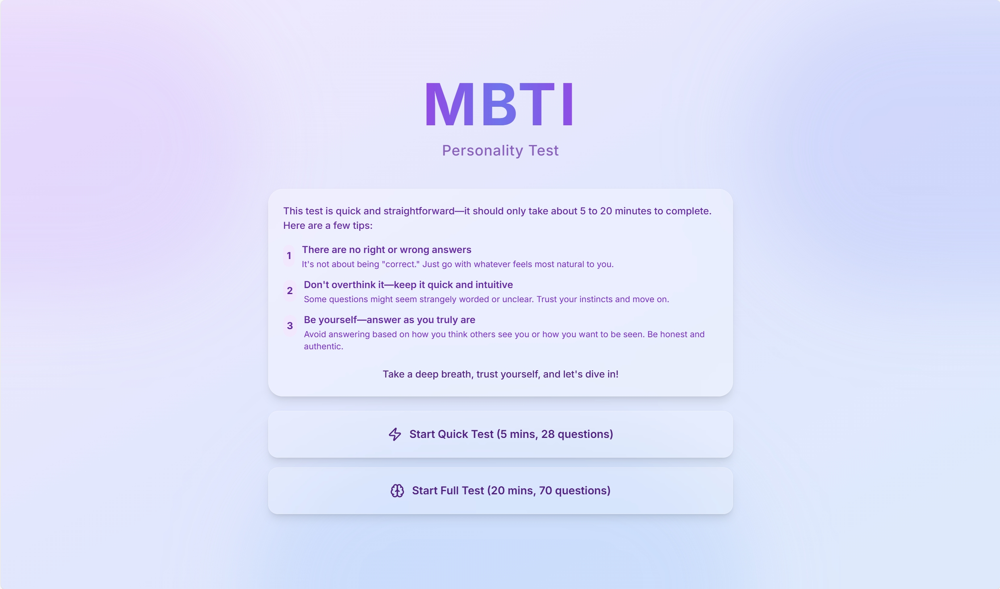
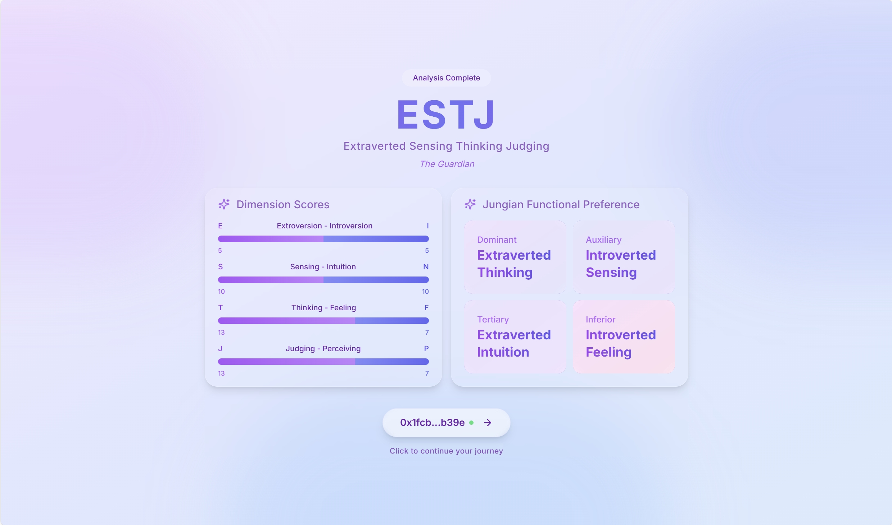
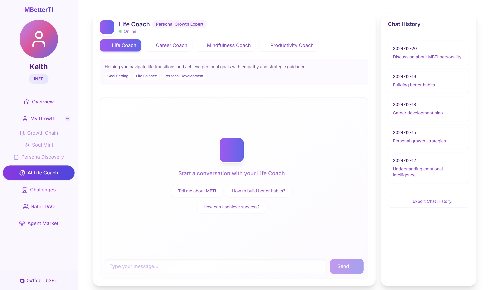

# MBetterTI

<div align="center">

[](https://m-better-ti.vercel.app)
[](LICENSE)
[](https://nextjs.org/)
[](https://www.typescriptlang.org/)
[](https://tailwindcss.com/)
[](https://firebase.google.com/)
[](https://soliditylang.org/)
[](https://deepmind.google/technologies/gemini/)

[English](README.md) · [简体中文](README.zh-CN.md) · [Live Demo](https://m-better-ti.vercel.app) · [Report Bug](https://github.com/yourusername/MBetterTI/issues) · [Request Feature](https://github.com/yourusername/MBetterTI/issues)

AI-Powered MBTI Growth Platform | Web3-Based Personal Development | Community-Driven Learning


</div>

## 📋 Table of Contents

- [About](#about)
- [Features](#features)
- [Live Demo](#live-demo)
- [Tech Stack](#tech-stack)
- [Getting Started](#getting-started)
- [Roadmap](#roadmap)
- [Contributing](#contributing)
- [Contact](#contact)
- [License](#license)

## 🎯 About <a name="about"></a>

**MBetterTI** is a personalized growth platform that combines MBTI testing, AI Life Coach, and Web3 technologies. By providing customized growth paths for different MBTI personality types, it helps users achieve personal growth and self-improvement.

### ✨ Why MBetterTI?

- 🤖 **AI-Powered Guidance** - Personalized coaching based on your MBTI type
- ⛓️ **Blockchain Integration** - Secure and permanent growth records
- 🤝 **Community Driven** - Peer review and support system
- 🎯 **Goal Oriented** - Structured growth path and challenges
- 🔄 **Continuous Learning** - Adaptive AI coaching that evolves with you

## 🚀 Features <a name="features"></a>

### 1. **Personalized AI Life Coach**
Based on the user's MBTI test results, the platform provides precise growth path suggestions and personalized plans. The AI Life Coach offers practical guidance and helps users adjust and improve during their growth journey.

### 2. **On-Chain Growth Records**
Users can store their growth records permanently on the blockchain after completing challenges, generating achievement badges as NFTs. These records serve as a testament to personal growth and can be showcased within the community.

### 3. **Growth Peer Review Community**
The peer review community allows users to confirm each other's challenge completion, increasing the authenticity of growth and fostering community interaction. It helps users support and encourage one another on their growth journey.

### 4. **Growth Profile Marketplace**
Advanced users can share or sell their growth profiles. New users can purchase or exchange profiles to generate an AI Life Coach, accelerating their personal growth.

## 🌐 Live Demo <a name="live-demo"></a>

Experience MBetterTI in action:

- 🔗 **Production**: [https://m-better-ti.vercel.app](https://m-better-ti.vercel.app)
- 📱 **Mobile-Friendly**: Fully responsive design
- 🔒 **Secure**: Web3 wallet integration

<details>
<summary>📸 More Screenshots</summary>
<br>





</details>

## 💻 Tech Stack <a name="tech-stack"></a>

<details>
<summary>Frontend</summary>

- Next.js 14 - React Framework
- TailwindCSS - Styling
- TypeScript - Type Safety
</details>

<details>
<summary>Backend & Database</summary>

- Firebase - Backend Services
</details>

<details>
<summary>Blockchain & Web3</summary>

- Solidity - Smart Contracts
- Thirdweb - Web3 Development
- Pinata - IPFS Storage
</details>

<details>
<summary>AI Integration</summary>

- Gemini API - Language Model
- Dify - AI Framework
</details>

## 🚀 Getting Started <a name="getting-started"></a>

### Prerequisites

- Node.js 18+
- npm or yarn
- Web3 wallet (MetaMask recommended)

### 1. Clone the Repository
```bash
git clone https://github.com/yourusername/MBetterTI.git
cd MBetterTI
```

### 2. Install Dependencies
```bash
npm install
```

### 3. Environment Setup
```bash
cp .env.example .env.local
```

Configure the following environment variables in `.env.local`:
- `NEXT_PUBLIC_FIREBASE_CONFIG` - Firebase configuration
- `NEXT_PUBLIC_WALLET_CONNECT` - WalletConnect configuration
- `AI_API_KEY` - AI service API key

### 4. Run the Development Server
```bash
npm run dev
```

### 5. Deploy to Production
You can deploy the application to production using Vercel or a custom deployment method.

## 📑 Roadmap <a name="roadmap"></a>

- [x] MVP Launch
- [x] AI Integration
- [ ] Mobile App Development
- [ ] Multi-language Support
- [ ] Advanced Analytics Dashboard
- [ ] Community DAO Implementation

See the [open issues](https://github.com/yourusername/MBetterTI/issues) for a full list of proposed features and known issues.

## 🤝 Contributing <a name="contributing"></a>

We welcome contributions to **MBetterTI**! Here's how you can get started:

1. Fork the repository
2. Create a new branch (`git checkout -b feature/your-feature`)
3. Commit your changes (`git commit -am 'Add new feature'`)
4. Push to your branch (`git push origin feature/your-feature`)
5. Create a new Pull Request

## 📞 Contact <a name="contact"></a>

Keith Guo - [@YourTwitter](https://twitter.com/yourtwitter) - kguodev@gmail.com

Project Link: [https://github.com/yourusername/MBetterTI](https://github.com/yourusername/MBetterTI)

## 📄 License <a name="license"></a>

Distributed under the MIT License. See `LICENSE` for more information.

---

<div align="center">
Made with ❤️ by Keith Guo
</div>
